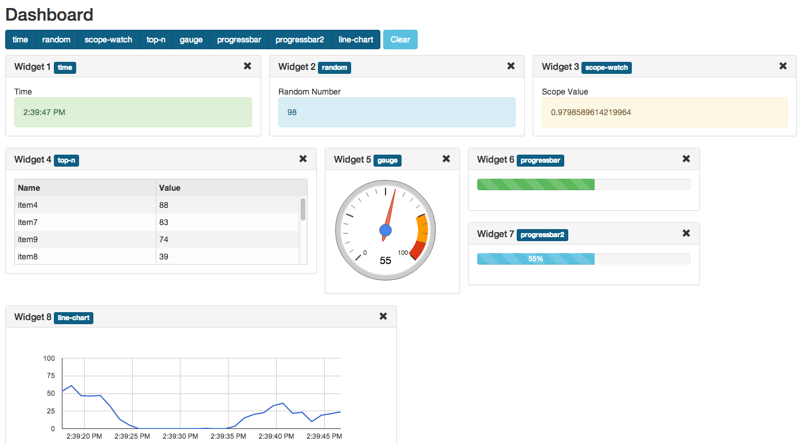

Generic AngularJS component/directive providing dashboard/widgets functionality.


Features:
---------

 - Adding/removing widgets

 - Widgets are instantiated dynamically (from corresponding directive or template)

 - Widgets drag and drop (with jQuery UI Sortable)
 
 - Horizontal and vertical widgets resize

 - Fluid layout (widgets can have percentage-based width, or have width set in any other unit)

 - Any directive or template can be a widget

 - Connecting widgets to real-time data (WebSocket, REST, etc.)

 - Changing widget data source dynamically (from widget options)

 - Saving widgets state to local storage

 - Multiple Dashboard Layouts

Contributing
------------

This project welcomes new contributors.

You acknowledge that your submissions to DataTorrent on this repository are made pursuant the terms of the Apache License, Version 2.0 (http://www.apache.org/licenses/LICENSE-2.0.html) and constitute "Contributions," as defined therein, and you represent and warrant that you have the right and authority to do so.

When **adding new javascript files**, please prepend the Apache v2.0 license header, which can be found in [CONTRIBUTING.md file](https://github.com/DataTorrent/malhar-angular-dashboard/blob/master/CONTRIBUTING.md).




Build
-----

 Project is built with Gulp.

 ``` bash
    $ npm install -g gulp
    $ gulp
 ```

Requirements
------------

- AngularJS
- Underscore.js
- jQuery
- jQuery UI
- Angular UI Sortable
- Angular Bootstrap

Example of including dependencies from CDN [here](src/index.html)

Getting Started
---------------

Running demo.

 ``` bash
    $ bower install
    $ gulp build:demo
    $ gulp serve
 ```

Application will be available at http://localhost:3000/

### download

With bower:

```
bower install malhar-angular-dashboard
```
For legacy reasons, this bower module is also registered as `angular-ui-dashboard`.

Manually:

Download the zip of this repo and use the files in the `dist` folder.

### include

Load `dist/malhar-angular-dashboard.js` and `dist/malhar-angular-dashboard.css` in your html:

```HTML
<link rel="stylesheet" href="bower_components/malhar-angular-dashboard/dist/malhar-angular-dashboard.css">
<script src="bower_components/malhar-angular-dashboard/dist/malhar-angular-dashboard.js"></script>
```

Also be sure to add it to your apps dependency list:

```JavaScript
angular.module('yourApp', [
  // other dependencies
  'ui.dashboard'
]);